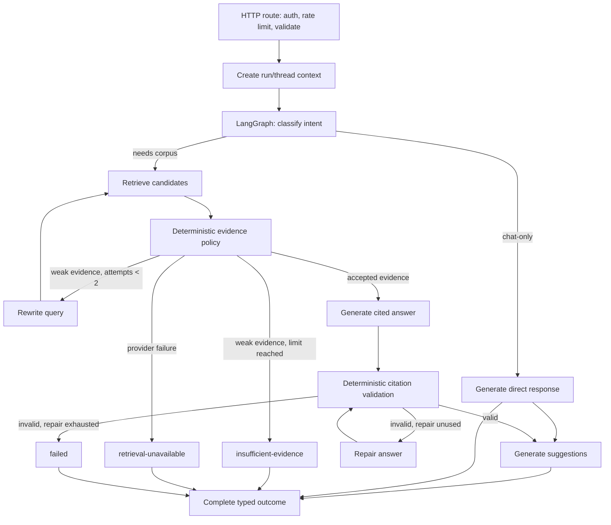

# Full LangGraph RAG TODO
> Deployment and repository-layout decisions are superseded by [`docs/MONOREPO-ARCHITECTURE-PLAN.md`](MONOREPO-ARCHITECTURE-PLAN.md). This checklist remains the behavioral LangGraph/RAG graph specification.

## Status

The FastAPI/LangGraph runner, BFF rollout controls, paired comparison harness, and ingestion worker now exist in the monorepo. The TypeScript AI SDK runner remains the production default and rollback path until the Phase 4 evaluation and controlled-traffic gate passes.

The graph semantics below preserve the existing runner's bounded attempts, evidence policy, citation validation, and terminal outcomes. Use the monorepo plan for service boundaries, deployment, rollout gates, and the `just` command runner.

## Target architecture



## Module responsibilities

### HTTP route — outside LangGraph

`app/api/question/route.ts` remains responsible for:

- authentication and authorization;
- distributed rate limiting and spend budgets;
- request-body parsing and bounds;
- `runId` and authorized `threadId` creation;
- AI SDK stream creation;
- cancellation propagation;
- runner selection; and
- projection of public runner events to UI stream parts.

The route must not own graph transitions, retrieval policy, prompts, or LangGraph state.

### LangGraph runner

Create `lib/agent/langgraph-runner.ts` implementing the existing `AgentTurnRunner` interface:

```ts
interface AgentTurnRunner {
  runTurn(
    input: AgentTurnInput,
    sink: AgentEventSink,
    signal?: AbortSignal,
  ): Promise<AgentTurnResult>;
}
```

The graph owns state transitions, conditional edges, bounded attempts, model-stage retry policy, checkpoint/resume behavior, terminal outcomes, and graph lifecycle events.

LangGraph state and LangChain messages must remain private to the runner. The route and UI receive only `AgentTurnResult` and `AgentEvent` values.

### Retriever — shared deep module

Keep `lib/rag/retriever.ts` as the retrieval seam. It owns:

- query normalization;
- dense, hybrid, or reranked retrieval;
- Pinecone namespace and ACL filters;
- score policy;
- deduplication and context budgeting;
- corpus revision checks;
- provenance and citation construction.

The graph calls the retriever. It must not call Pinecone directly.

### Evidence policy node

Use deterministic checks for:

- finite and calibrated scores;
- required metadata;
- corpus revision;
- authorized scope;
- duplicate vector IDs;
- accepted passage count; and
- context budget.

An optional model relevance grader may assist ranking, but it must not bypass these checks.

### Citation validation node

Validate citations deterministically:

```text
answer.citationIds
  → every ID exists in accepted passages
  → every cited source appears in response citations
  → valid: continue
  → invalid and repairCount = 0: repair once
  → invalid and repairCount = 1: fail
```

Never add an edge that returns an answer after citation validation fails.

## Graph state

Keep checkpoint state small, versioned, and scope-bound:

```ts
type RagGraphState = {
  runId: string;
  threadId?: string;
  principalId: string;
  accessScope: string;

  messagesRef: string;
  latestQuestion: string;
  retrievalQuery: string;
  retrievalAttempt: number;
  citationRepairAttempt: number;

  corpusRevision: string;
  modelVersion: string;
  embeddingVersion: string;
  retrievalPolicyVersion: string;

  groundingStatus:
    | "not-started"
    | "grounded"
    | "insufficient-evidence"
    | "unavailable";

  acceptedPassageIds: string[];
  citationIds: string[];
  answer?: string;
  suggestions?: string[];

  outcome?: AgentTurnOutcome;
  errorCode?: string;
};
```

Do not checkpoint raw prompts, complete passage bodies, or answers by default. Use encrypted references when resumability requires persisted content.

## Implementation phases

### Phase 0 — production prerequisites

- [ ] Define the authenticated principal and principal-to-tenant/ACL contract.
- [ ] Add distributed per-principal/IP rate limits and an explicit model/retrieval spend budget.
- [ ] Apply trusted namespace or metadata ACL filters before Pinecone results reach the model.
- [ ] Change malformed Pinecone scores from `0` coercion to fail-closed rejection.
- [ ] Produce an immutable ingestion manifest containing source IDs, hashes, ACL metadata, embedding model/input mode, and `corpusRevision`.
- [ ] Complete `data/rag-eval-cases.json` and establish the required production baseline.
- [ ] Keep a last-known-good corpus revision for rollback.

**Gate:** No unrestricted traffic until unauthorized requests, missing scope, malformed metadata, and baseline evaluation failures are rejected safely.

### Phase 1 — graph and shared contracts

- [ ] Add `lib/agent/langgraph-runner.ts` behind `AgentTurnRunner`.
- [ ] Define private LangGraph state with bounded counters and version fields.
- [ ] Implement nodes for intent classification, direct response, retrieval, evidence policy, query rewrite, answer generation, citation validation, repair, suggestions, and completion.
- [ ] Implement conditional edges for direct, grounded, unavailable, insufficient-evidence, invalid-citation, and failed outcomes.
- [ ] Preserve hard bounds: two retrieval attempts and one citation repair.
- [ ] Reuse `lib/rag/retriever.ts`; do not duplicate Pinecone or citation policy inside the graph.
- [ ] Map graph lifecycle events to `AgentEventSink` without exposing graph state.
- [ ] Add a server-side runner selector while keeping the AI SDK runner as the default.

**Gate:** The LangGraph runner passes the same observable runner, event-order, cancellation, citation, and terminal-outcome tests as the AI SDK runner.

### Phase 2 — durability and reliability

- [ ] Select an encrypted, scope-aware checkpointer only if durable resume is a real product requirement.
- [ ] Authorize every `threadId` before loading or writing checkpoints.
- [ ] Define checkpoint retention, deletion, encryption, and replay policy.
- [ ] Add per-node deadlines shorter than the route's 120-second ceiling.
- [ ] Retry only classified transient provider failures with bounded retry counts.
- [ ] Add concurrency bulkheads and circuit breakers for model and Pinecone dependencies.
- [ ] Ensure cancellation stops future graph nodes and does not turn provider failure into ordinary model output.
- [ ] Add redacted OpenTelemetry/AI SDK telemetry for graph runs, node durations, token/cost estimates, and terminal outcomes.

**Gate:** Fault injection proves bounded latency, bounded retries, safe cancellation, authorized checkpoint access, and no sensitive prompt/passage leakage in telemetry.

### Phase 3 — shadow comparison

- [ ] Run AI SDK and LangGraph runners against identical evaluation cases and corpus revision.
- [ ] Compare groundedness, answer correctness, citation precision/completeness, retrieval recall/rank, attempts, latency, token use, cost, and failure rates.
- [ ] Run adversarial cases for prompt injection, poisoned passages, citation spoofing, ACL leakage, malformed metadata, and oversized input.
- [ ] Run a limited authenticated shadow cohort without changing user-visible results.
- [ ] Record maintenance and operational complexity, not only model quality.

**Gate:** LangGraph must provide a material quality/reliability benefit or satisfy a documented durable-workflow requirement without violating streaming, cancellation, cost, latency, or security budgets.

### Phase 4 — controlled promotion

- [ ] Enable LangGraph for a small feature-flagged cohort.
- [ ] Monitor quality, unavailable rate, invalid citations, latency, cost, checkpoint failures, and rollback health.
- [ ] Keep the AI SDK runner available as an immediate fallback.
- [ ] Promote only after the limited cohort meets the frozen evaluation and operational gates.
- [ ] Remove the selector and obsolete runner only after a clean cutover decision; do not leave unowned dual paths indefinitely.

## LangGraph features

### Use in the first production implementation

- `StateGraph` with typed state.
- Conditional edges.
- Bounded retry policies for transient failures.
- Checkpoint identifiers only when authenticated durable threads are required.
- Custom events mapped to the existing `AgentEventSink`.
- Per-node timing and outcome telemetry.

### Defer until justified

- Interrupts and human approval for workflows that have no high-risk actions.
- Subgraphs before independent workflows actually exist.
- Background execution before request duration requires it.
- LangGraph Agent Server.
- Multiple collaborating agents.
- Long-term memory.
- Semantic answer caching.

## Explicit non-goals

- Do not migrate to LangChain or LangGraph merely to claim production readiness.
- Do not let LangGraph own Pinecone, ACL enforcement, citation construction, or HTTP streaming.
- Do not expose LangGraph state or LangChain messages through the route or UI.
- Do not weaken citation validation, retrieval failure semantics, or request bounds.
- Do not add unbounded loops, retries, durable memory, or raw prompt/passage logging.

## Reference decisions

- Current production baseline: `lib/agent/ai-sdk-runner.ts`.
- Future implementation seam: `lib/agent/langgraph-runner.ts`.
- Shared retrieval seam: `lib/rag/retriever.ts`.
- Shared application contracts: `lib/agent/types.ts`.
- Stream/trace adapter: `lib/agent/ai-sdk-event-sink.ts` and `lib/agent/structured-trace-sink.ts`.
- Architecture source: [`docs/superpowers/specs/2026-09-18-agentic-rag-design.md`](superpowers/specs/2026-09-18-agentic-rag-design.md).
- Production hardening roadmap: [`../IMPROVEMNETS.md`](../IMPROVEMNETS.md).
