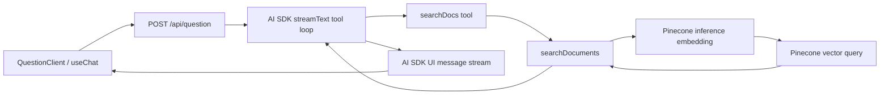

# Current Pali Docs RAG pipeline review

## Executive summary

Pali Docs already has a small agent loop: Vercel AI SDK 5 lets the model call Pinecone search, injects retrieved passages into the next model step, and streams progress events to the UI. The provider, embedding, vector-store, retrieval, prompt, and client layers are separated reasonably well.

The system is not yet a reliable agentic RAG pipeline. The highest-priority problem is concrete: search queries are embedded with `inputType: "passage"`, although Pinecone distinguishes search queries from indexed passages and documents `query` for user search text. The route also converts retrieval failures into empty results and then permits a general-knowledge answer, prevents meaningful iterative retrieval, lacks provenance and citations, and has no retrieval or grounded-answer evaluation.

The safest path is therefore:

1. correct and measure the existing retrieval path;
2. deepen it behind one retrieval/grounding interface;
3. add explicit bounded retrieve-grade-rewrite-generate control flow;
4. adopt LangGraph persistence or managed agent infrastructure only when durable execution is a product requirement.

## Current architecture



### Request and orchestration

- `app/api/question/route.ts` owns request parsing, the model loop, search and suggestion tools, retrieval state, prompt injection, and UI-stream events.
- `stopWhenAnswered` stops after five steps or after any latest step emits more than 150 text characters. This is not tied to retrieval, grounded generation, or suggestion completion.
- Search state is closure-local. After the first search call, every later call receives the first result even if it supplies a different query.
- Once any non-empty result exists, `prepareStep` removes the search tool and allows only suggestion generation.
- There is no durable thread, checkpoint, replay, or server-side memory. Conversation history is client-carried.

### Retrieval

- `lib/services/rag-pipeline.ts` runs query embedding, Pinecone search, and context formatting.
- `lib/services/embedding.ts` calls Pinecone's `llama-text-embed-v2` and has a process-local exact-string LRU cache with 100 entries and a one-hour TTL.
- `lib/services/vector-store.ts` returns only `id`, `score`, and `text`. It has no score threshold, metadata filters, provenance contract, deduplication, diversity selection, reranking, or context budget.
- Ten passages are requested by the route and concatenated verbatim with separators.
- The repository does not contain the Pinecone ingestion, chunking, source-metadata, or corpus-versioning pipeline. `scripts/update-index.mjs` updates Algolia only.

### Client projection

The route streams answer text plus `data-status`, `data-task`, `data-reasoning`, and `data-suggestions`. This is a useful product contract, but it is coupled directly to the route's loop. Runtime Zod schemas exist for these event families but production consumers identify parts by tag and cast their payloads rather than parsing them.

## Strengths worth preserving

- Small, understandable provider and retrieval modules.
- Existing Node.js route and streaming UI already support multi-step tool execution.
- Bounded model-loop duration.
- Tool inputs use Zod.
- Retrieval scores survive the Pinecone adapter and can support later quality gates.
- The embedding cache is capacity- and time-bounded.
- Search progress and failure states are visible to the UI.

## Prioritized findings

### P0: retrieval correctness and trust boundaries

1. **Search queries use the passage embedding mode.** `generateEmbedding()` always sends `inputType: "passage"`, including when `searchDocuments()` embeds a user/model search query. Pinecone documents `query` for search terms and `passage` for stored documents. Existing embedding tests currently preserve the wrong behavior.
2. **Retrieval failure can produce an apparently normal ungrounded answer.** The search tool catches embedding/Pinecone errors and returns empty matches. The system prompt allows general-knowledge answers when search returns no passages. The model cannot distinguish “no evidence” from “retrieval unavailable.”
3. **The public request is client-authoritative and unbounded.** The route destructures `messages` from arbitrary JSON and forwards the history to the model without a request schema, role policy, history/token bound, authentication, or rate limiting.
4. **Retrieved passages enter a system message verbatim.** There is no provenance envelope, explicit data/instruction boundary, or prompt-injection policy for indexed content.

### P1: retrieval quality and grounded output

5. **One-shot retrieval prevents correction.** A second query receives the first cached result, and successful retrieval disables search. The model cannot reformulate, decompose, broaden, or recover from weak evidence.
6. **No evidence acceptance policy exists.** Scores are retained but ignored. There is no threshold, grade, rerank, source diversity, or explicit insufficient-evidence result.
7. **No citation contract exists.** Matches discard source title, URL/path, section, chunk location, and corpus revision. The answer cannot expose claim-to-source support.
8. **Context is unbudgeted.** Ten raw passages can crowd out conversation and increase cost; selection and formatting policy leak into the route.
9. **The stop condition is unrelated to task completion.** A long direct answer can terminate before retrieval or follow-up generation.

### P1: measurement and operations

10. **No retrieval or answer-quality baseline exists.** Tests mostly validate mocked delegation and event plumbing. There is no representative question set, recall/ranking measure, groundedness check, citation accuracy check, prompt-injection case, or end-to-end latency/cost record.
11. **UI events are not operational telemetry.** There are no request/run IDs, spans, retrieval query and scores, model/token/cost data, cache outcomes, or linked user feedback.
12. **Configuration fails late.** Missing Pinecone values become empty strings, an unknown provider falls back to OpenRouter, and errors can be sent directly to users.

### P2: state, cache, and client defects

13. **State is request-local.** No checkpoint, resume, idempotency, replay, approval, or cross-turn tool state exists.
14. **Caching is opportunistic only.** The embedding cache is process-local and unversioned; the request search cache is not keyed by query. There is no corpus revision, cross-instance retrieval cache, semantic response cache, or CAG prefix.
15. **Client phase and error state have correctness defects.** Historical running task parts can keep the phase at `searching`; errors persist because retry, clear, and the visible dismiss button do not clear them.
16. **Documentation has drifted.** `docs/RAG-WORKFLOW.md` describes a different stop rule, top-K value, tool policy, environment fallback, error path, and a nonexistent suggestions service.

## Missing capabilities for agentic RAG

- Explicit typed workflow state and bounded transitions.
- Retrieval decision, query rewriting, iterative retrieval, relevance grading, and deterministic termination.
- Provenance, citations, groundedness policy, and abstention when evidence is unavailable.
- Clear separation between retrieval failure and relevant-document absence.
- Conversation-memory policy distinct from graph working state, corpus context, and caches.
- Cancellation, timeouts, transient retry policy, and stable idempotency semantics.
- Offline retrieval and grounded-answer evaluation plus production tracing.
- Corpus revisioning and cache invalidation.

## Recommended module boundaries

### `Retriever`

```ts
interface Retriever {
  retrieve(
    request: RetrievalRequest,
    signal?: AbortSignal,
  ): Promise<GroundingBundle>;
}
```

This module should hide query normalization, query-versus-passage embedding mode, Pinecone, candidate count, filtering, reranking, deduplication, provenance, cache policy, corpus revision, and context budgeting. Callers should receive accepted passages, citations, quality metadata, and an explicit outcome such as `grounded`, `insufficient-evidence`, or `unavailable`; they should not rebuild a prompt from raw matches.

### `AgentTurnRunner`

```ts
interface AgentTurnRunner {
  runTurn(input: AgentTurnInput, sink: AgentEventSink, signal?: AbortSignal): Promise<AgentTurnResult>;
}
```

The route should own HTTP validation and stream adaptation only. The runner should hide AI SDK or LangGraph mechanics, transition limits, tool policy, retrieval retries, degraded-mode policy, and optional checkpointing.

### `KnowledgeContextProvider`

```ts
interface KnowledgeContextProvider {
  getContext(request: ContextRequest, budget: ContextBudget): Promise<ContextBundle>;
}
```

This seam is justified only if two implementations are evaluated: dynamic Pinecone retrieval and a versioned static-core CAG/prefix-cache path. Both must return the same provenance and freshness contract.

### `AgentEventSink`

Keep the current user-visible event vocabulary independent of orchestration. One adapter should emit AI SDK UI chunks; another can record traces. Define ordering, terminal, and error invariants and parse event payloads at runtime.

## Immediate decision sequence

1. Fix the query embedding mode and make retrieval failure explicit.
2. Introduce corpus/source metadata and a representative evaluation dataset.
3. Add thresholds, context budgeting, citations, and observability inside a deep retrieval module.
4. Implement a bounded retrieve-grade-rewrite-generate workflow while preserving the existing UI stream.
5. Compare an AI SDK-first implementation with a raw LangGraph implementation using the same retrieval interface and evaluation set.
6. Add durable checkpoints only when resume, approval, or cross-request execution is required.
7. Add exact retrieval caching after corpus revisioning; pilot semantic response caching or static-core CAG only when measurements show appropriate traffic and corpus characteristics.

## Sources

- Local implementation: [`app/api/question/route.ts`](../../app/api/question/route.ts), [`lib/services/rag-pipeline.ts`](../../lib/services/rag-pipeline.ts), [`lib/services/embedding.ts`](../../lib/services/embedding.ts), [`lib/services/vector-store.ts`](../../lib/services/vector-store.ts), [`hooks/use-ai-chat.ts`](../../hooks/use-ai-chat.ts)
- Pinecone, [`llama-text-embed-v2`](https://docs.pinecone.io/models/llama-text-embed-v2)
- Pinecone, [ingest-files quickstart showing `passage` for chunks and `query` for search](https://docs.pinecone.io/guides/get-started/quickstart/ingest-files)
- Vercel AI SDK, [agents overview](https://ai-sdk.dev/docs/agents/overview)
- Vercel AI SDK, [workflow patterns](https://ai-sdk.dev/docs/agents/workflows)
