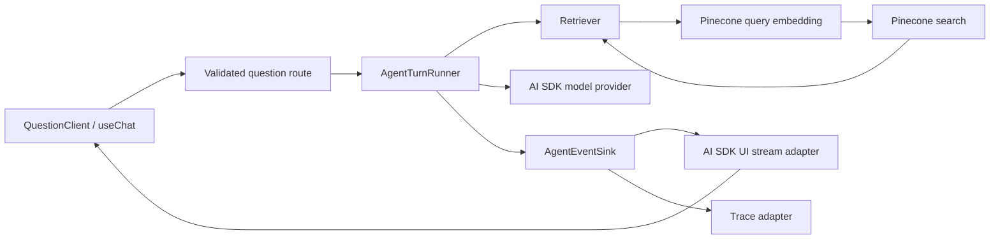
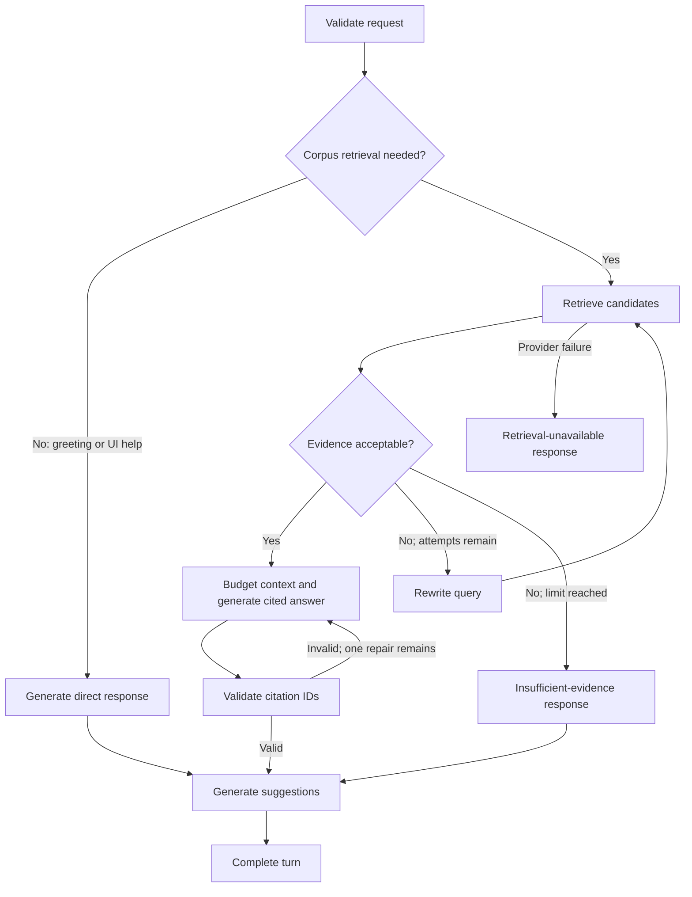

# Agentic RAG Evolution Design

**Date:** 2026-09-18
**Status:** Approved
**Author:** Brainstorming session

## Problem

Pali Docs already has a bounded model/tool loop in `app/api/question/route.ts`: Vercel AI SDK 5 lets the model call a Pinecone search tool, injects retrieved passages into a later model step, and streams progress events to the client. This is a useful base, but it is not yet a reliable agentic RAG system.

The immediate risks are retrieval correctness and grounding, not the absence of an agent framework:

- search queries are embedded with Pinecone's `passage` input mode instead of `query`;
- retrieval failures are converted to empty results and can lead to ungrounded general-knowledge answers;
- the first search result is reused for all later queries, preventing corrective retrieval;
- no score policy, reranking, context budget, provenance, citations, corpus revision, or quality evaluation exists;
- the completion heuristic can terminate a turn after 150 generated characters, independent of retrieval or follow-up completion;
- request history and retrieved text cross trust boundaries without adequate validation or instruction/data separation;
- orchestration, retrieval policy, and UI-stream mechanics are coupled in one route.

A wholesale LangChain migration would add dependencies and a second model/tool abstraction before these underlying problems are measured or fixed. Conversely, refusing an orchestration runtime entirely would leave no clean path to explicit graph state, checkpoints, resume, or human approval.

## Goals

- Correct and measure the current retrieval path before framework migration.
- Produce grounded answers with source metadata and validated citations.
- Distinguish insufficient evidence from retrieval-system failure.
- Support bounded query rewriting and corrective retrieval.
- Keep the current AI SDK client and streamed progress experience.
- Place orchestration behind a framework-neutral application interface.
- Compare an AI SDK implementation and a raw LangGraph implementation using identical contracts and evaluations.
- Adopt durable state and advanced caches only when a measured product requirement justifies them.

## Non-goals

- Immediate migration of all AI features to LangChain.
- Multiple collaborating agents or specialist subgraphs.
- Long-term user memory without explicit product semantics and retention policy.
- LangGraph Agent Server or background execution in the first implementation.
- Semantic answer caching as the global request path.
- Replacing Pinecone with CAG for the changing corpus.
- Retrying indefinitely or hiding provider failure behind a plausible answer.

## Decision summary

Use a **dual-track staged architecture**:

1. harden retrieval, provenance, evaluation, and tracing;
2. define stable `Retriever`, `AgentTurnRunner`, and `AgentEventSink` boundaries;
3. ship an AI SDK-based production runner through those boundaries;
4. implement an equivalent raw LangGraph runner as a controlled comparison;
5. promote LangGraph only if measured benefits or durable-workflow requirements justify it;
6. keep LangChain `createAgent`, persistent checkpoints, LangCache, and CAG out of the critical path until their individual adoption gates are met.

## Architecture



### HTTP route

`app/api/question/route.ts` becomes a transport adapter. It is responsible for:

- parsing and bounding the request with Zod;
- establishing request/run identity and optional authenticated thread identity;
- creating the AI SDK UI stream sink;
- selecting one server-side runner;
- propagating cancellation;
- translating typed terminal outcomes to HTTP/stream behavior.

It does not own retrieval policy, rewrite limits, graph transitions, prompt assembly, or framework-specific state.

### `Retriever`

```ts
interface Retriever {
  retrieve(
    request: RetrievalRequest,
    signal?: AbortSignal,
  ): Promise<GroundingBundle>;
}
```

The retriever is one deep module that hides:

- query normalization and the query embedding input mode;
- Pinecone namespace, filters, and candidate count;
- exact retrieval caching and corpus-revision keys;
- score thresholds, deduplication, and diversity;
- optional reranking;
- source/provenance mapping;
- accepted-passage selection and context budgeting;
- retrieval latency and quality metrics.

`GroundingBundle` returns accepted passages, citation records, corpus revision, cache status, quality metadata, and one explicit outcome:

- `grounded`;
- `insufficient-evidence`;
- `unavailable`.

Callers do not concatenate raw Pinecone matches or decide whether provider failure means no evidence.

### `AgentTurnRunner`

```ts
interface AgentTurnRunner {
  runTurn(
    input: AgentTurnInput,
    sink: AgentEventSink,
    signal?: AbortSignal,
  ): Promise<AgentTurnResult>;
}
```

Two implementations use the same application contracts:

- `AiSdkAgentTurnRunner`: production baseline;
- `LangGraphAgentTurnRunner`: comparison implementation.

Framework types do not escape the runner. The route and UI never receive LangGraph state or LangChain messages.

### Shared turn state

- validated question and bounded conversation context;
- `runId`, optional authorized `threadId`, and `corpusRevision`;
- current retrieval query and rewrite count;
- retrieval outcome;
- candidate and accepted passages with provenance;
- context token budget;
- answer text and cited passage IDs;
- terminal outcome, stage timings, and usage metrics.

### `AgentEventSink`

The runner emits orchestration-neutral events. Adapters translate them to the existing AI SDK data-part vocabulary and to traces.

Event families:

- run started;
- retrieval started, completed, or failed;
- query rewritten;
- generation started;
- answer delta;
- citations completed;
- suggestions completed;
- run completed or failed.

The event contract defines ordering, correlation IDs, and terminal-state invariants. Payloads are runtime-validated. The existing client protocol remains stable during the first cutover; UI vocabulary can evolve separately.

## Turn data flow



Hard bounds:

- at most two retrieval attempts;
- at most one citation repair;
- no automatic retry for relevance failures;
- transient network retries only;
- retrieval failure never becomes insufficient evidence;
- general-knowledge Pali claims are disallowed unless a separate product policy explicitly labels them as outside-corpus content;
- suggestion failure cannot discard a valid answer.

## Retrieval and grounding policy

### Evidence

Every accepted passage includes a stable passage ID, source identifier, title or path, section or anchor when available, score, and corpus revision. The generated answer cites only accepted passage IDs.

Citation validation is deterministic:

- every emitted citation ID must exist in the accepted context;
- a cited source must be included in the response citation payload;
- invalid IDs permit one bounded repair;
- a second failure terminates with a validation outcome rather than inventing a source.

### Weak evidence

Weak candidates trigger one query rewrite when the attempt budget remains. Exhausted weak evidence produces an explicit insufficient-evidence answer. Relevance failure is a normal domain outcome, not an exception.

### Retrieval failure

Embedding or Pinecone failure produces an `unavailable` outcome and a visible degraded-service response. It never silently produces an ordinary answer. Automatic retries apply only to classified transient failures and honor request cancellation.

## Security and data governance

- Parse requests with Zod.
- Bound message count, per-message size, total history size, allowed roles, and accepted content-part types.
- Treat retrieved passages as untrusted data. Use structured envelopes and explicit instruction/data boundaries.
- Add authentication and rate limiting before enabling durable threads or more expensive iterative workflows.
- Authorize every client-provided `threadId` against the current user.
- Do not expose internal graph state through stream `values`; project only public events and outputs.
- Redact or sample traces because prompts, passages, tool inputs, and answers can contain sensitive content.
- Define checkpoint retention, deletion, and encryption policy before persistence is enabled.

## AI SDK runner

The AI SDK runner is the production baseline because it preserves the current provider, model, tools, stream transport, and client integration.

It implements explicit workflow stages rather than relying on the current 150-character stop heuristic. It may use ordinary TypeScript control flow plus AI SDK calls. The newer AI SDK `ToolLoopAgent` is not available in the installed AI SDK 5 package, so an AI SDK upgrade is a separate migration decision and not required for the first runner.

The runner must not expose AI SDK step objects through the application interface. Tests assert observable outcomes and events.

## LangGraph comparison runner

The comparison runner uses raw `@langchain/langgraph` and `@langchain/core` with ordinary nodes and conditional edges. It calls the existing AI SDK provider and the same `Retriever`; it does not require LangChain `createAgent`.

Initial graph stages:

1. decide whether corpus retrieval is required;
2. retrieve;
3. grade evidence;
4. rewrite query when allowed;
5. generate a cited answer;
6. validate citations;
7. generate suggestions;
8. complete with a typed outcome.

The first comparison excludes:

- checkpointers;
- subgraphs;
- interrupts;
- long-term stores;
- LangChain agents;
- LangGraph Agent Server.

AI SDK token and application events are adapted through LangGraph custom events and then to `AgentEventSink`. A server-side feature flag selects exactly one runner per request.

## LangChain decision

Do not migrate the server loop to LangChain `createAgent` initially. It would require a second provider/model abstraction, LangChain message/tool types, `@ai-sdk/langchain` transport adaptation, and a wider dependency surface without fixing retrieval quality.

LangChain becomes justified if evaluation later demonstrates material value from its agent middleware, reusable tool/model policies, or ecosystem integrations. LangSmith may be adopted independently for AI SDK tracing and evaluation, subject to exact installed-version compatibility, privacy, sampling, retention, and cost review.

## Caching and CAG

Caching layers are distinct and adopted independently.

1. Introduce `corpusRevision` plus prompt, model, embedding, and retrieval-policy versions.
2. Verify provider prefix-cache behavior through OpenRouter usage metadata.
3. Add a versioned exact retrieval-result cache only when duplicate-query rate or retrieval latency justifies it.
4. Pilot Redis LangCache only for public, standalone, stable FAQ questions, with exact-first lookup, conservative semantic thresholds, hard scope attributes, short TTLs, invalidation, and a kill switch.
5. Benchmark CAG only for a versioned static core that comfortably fits the selected model's effective context. Pinecone remains the freshness, access-control, and long-tail path.

No response cache or CAG path can bypass access scope, corpus revision, or citation validation.

## Evaluation

Create one representative Thai/Pali dataset before changing orchestration. Record the current baseline and use the same cases for both runners.

Measure:

- retrieval recall and accepted-source rank;
- correct classification of insufficient evidence versus retrieval failure;
- answer correctness and groundedness;
- citation precision and completeness;
- resistance to instructions embedded in retrieved passages;
- per-stage latency, token use, model cost, and search count;
- cache false-hit and stale-answer rates;
- behavioral equivalence, implementation size, and maintenance burden between runners.

LangGraph is promoted only if it improves measured quality or reliability, materially simplifies required control flow, or unlocks a required durable feature while preserving streaming, cancellation, and cost/latency budgets.

## Migration phases

### Phase 0: correctness baseline

- Correct query embedding mode.
- Validate and bound route input.
- Separate unavailable retrieval from insufficient evidence.
- Remove the text-length stop heuristic.
- Correct stale RAG documentation.
- Establish the evaluation dataset and baseline metrics.

### Phase 1: deep retrieval

- Add provenance and corpus revision.
- Replace split retrieval/formatting responsibilities with `Retriever`.
- Add evidence selection, context budgeting, citations, and tracing.

The Pinecone ingestion process is not present in this repository. Its owner must add source metadata and corpus revision before end-to-end citations and safe cache invalidation can be completed.

### Phase 2: AI SDK production runner

- Move orchestration from the route to `AiSdkAgentTurnRunner`.
- Implement the approved bounded flow.
- Preserve UI data parts through `AgentEventSink`.
- Verify observable behavior and event ordering.

### Phase 3: LangGraph comparison

- Add compatible, pinned LangGraph dependencies.
- Implement the equivalent graph behind the same interface.
- Run offline comparison and a controlled canary or shadow evaluation.

### Phase 4: adoption gate

Promote LangGraph only when the evaluation gate passes. Otherwise retain the AI SDK runner and remove the experimental runner and dependencies.

### Phase 5: optional durability and caches

- Add an external checkpointer only for a defined resume, approval, or cross-request feature.
- Add versioned exact retrieval caching if measurements support it.
- Pilot LangCache and static-core CAG independently.

## Rollout and rollback

- Attach runner name, run ID, and corpus revision to metrics.
- Keep runner selection server-side.
- Compare offline before user traffic.
- Use a small canary or shadow cohort with immediate rollback.
- Never execute both paid runners for the same ordinary production response.
- Do not persist checkpoint data until ownership, retention, and deletion rules exist.
- Do not populate answer caches until citation validation succeeds.

## Verification strategy

High-value permanent tests cover:

- query versus passage embedding mode;
- request validation and history bounds;
- unavailable versus insufficient-evidence outcomes;
- rewrite and citation-repair limits;
- provenance and citation validation;
- event ordering and one terminal event;
- cancellation propagation;
- shared runner conformance behavior;
- cache revision and access-scope boundaries when caches are added.

The representative evaluation dataset, an end-to-end smoke run, and observed UI streaming are the proof of behavioral quality. Mocked plumbing tests alone are insufficient.

## Research basis

- [`docs/research/current-rag-pipeline-review.md`](../../research/current-rag-pipeline-review.md)
- [`docs/research/langchain-agentic-rag.md`](../../research/langchain-agentic-rag.md)
- [`docs/research/langgraph-agentic-rag.md`](../../research/langgraph-agentic-rag.md)
- [`docs/research/cache-and-cag-for-agentic-rag.md`](../../research/cache-and-cag-for-agentic-rag.md)

Primary external references are cataloged in those research documents.
